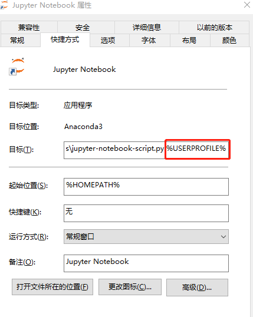

# 1.2 Pytorch环境搭建
PyTorch的安装十分简单，根据[PyTorch官网](https://pytorch.org/)，对系统选择和安装方式等灵活选择即可。
这里以[anaconda](https://www.anaconda.com/)为例，简单的说一下步骤和要点。
国内安装anaconda建议使用[清华](https://mirrors.tuna.tsinghua.edu.cn/help/anaconda/)镜像。

前些日子，由于合规问题中科大、清华镜像都已经关闭。目前只有清华镜像恢复，所以目前可以继续使用

# 1.2.1 安装Pytorch
pytorch的安装经过了几次变化，请大家以官网的安装命令为准。另外需要说明的就是在1.2版本以后，pytorch只支持cuda 9.2以上了，所以需要对cuda进行升级，目前测试大部分显卡都可以用，包括笔记本的MX250也是可以顺利升级到cuda 10.1。

我个人测试使用官网的安装命令进行安装时并不能安装1.3版原因未知（如果大家conda安装也有问题可以一起讨论下原因），所以这里建议大家使用pip进行安装，经过测试 pip是没有任何问题的。

目前(2020/7)的稳定版本为1.5.1。
```bash
#默认 使用 cuda10.2
pip3 install torch===1.5.1 torchvision===0.6.1 -f https://download.pytorch.org/whl/torch_stable.html

#cuda 9.2
pip3 install torch==1.5.1+cu92 torchvision==0.6.1+cu92 -f https://download.pytorch.org/whl/torch_stable.html

#cpu版本
pip install torch==1.5.1+cpu torchvision==0.6.1+cpu -f https://download.pytorch.org/whl/torch_stable.html
```

验证输入python 进入
```python
import torch
torch.__version__
# 得到结果'1.5.0'
```

## 1.2.2 配置 Jupyter Notebook
新建的环境是没有安装安装ipykernel的所以无法注册到Jupyter Notebook中，所以先要准备下环境
```bash
#安装ipykernel
conda install ipykernel
#写入环境
python -m ipykernel install  --name pytorch --display-name "Pytorch for Deeplearning"
```
下一步就是定制 Jupyter Notebook
```bash
#切换回基础环境
activate base
#创建jupyter notebook配置文件
jupyter notebook --generate-config
## 这里会显示创建jupyter_notebook_config.py的具体位置
```
打开文件，修改
```
c.NotebookApp.notebook_dir = '' 默认目录位置
c.NotebookApp.iopub_data_rate_limit = 100000000 这个改大一些否则有可能报错
```

## 1.2.3 测试
至此 Pytorch 的开发环境安装完成，可以在开始菜单中打开Jupyter Notebook 在New 菜单中创建文件时选择`Pytorch for Deeplearning` 创建PyTorch的相关开发环境了

## 1.2.4 问题解决

### 问题1：启动python提示编码错误

删除 .python_history [来源](http://tantai.org/posts/install-keras-pytorch-jupyter-notebook-Anaconda-window-10-cpu/)
### 问题2 默认目录设置不起效
打开快捷方式，看看快捷方式是否跟这个截图一样，如果是则删除 `%USERPROFILE%` 改参数会覆盖掉notebook_dir设置，导致配置不起效



如果你还发现其他问题，请直接留言


