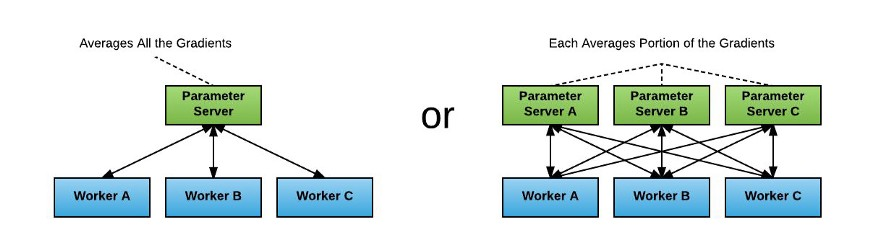
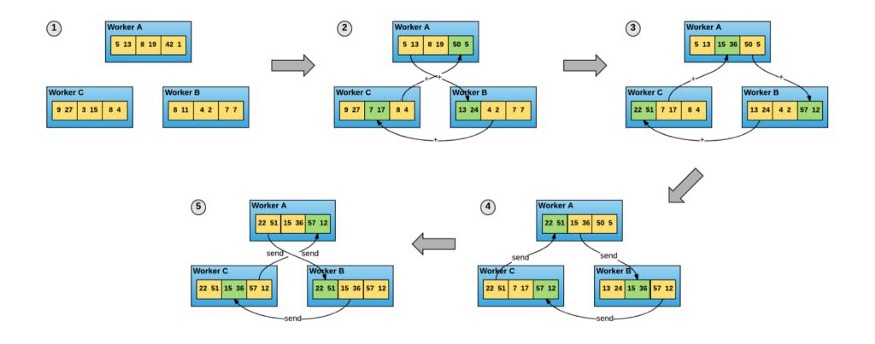
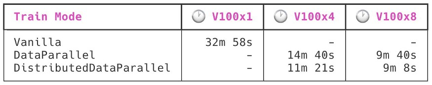

# 在PyTorch中使用DistributedDataParallel进行多GPU分布式模型训练

注：本篇文章是我与公众号（deephub-imba）合作翻译的第一篇文章，因为是翻译别人的作品所以首先注明下来源信息吧：

本文连接（要梯子）：https://towardsdatascience.com/distributed-model-training-in-pytorch-using-distributeddataparallel-d3d3864dc2a7

作者：Aleksey Bilogur


先进的深度学习模型参数正以指数级速度增长:去年的GPT-2有大约7.5亿个参数，今年的GPT-3有1750亿个参数。虽然GPT是一个比较极端的例子但是各种SOTA模型正在推动越来越大的模型进入生产应用程序，这里的最大挑战是使用GPU卡在合理的时间内完成模型训练工作的能力。

为了解决这些问题，从业者越来越多地转向分布式训练。 分布式训练是使用多个GPU和/或多个机器训练深度学习模型的技术。 分布式训练作业使您能够克服单GPU内存瓶颈，通过同时利用多个GPU来开发更大，功能更强大的模型。

这篇文章是使用torch.nn.parallel.DistributedDataParallel API在纯PyTorch中进行分布式训练的简介。 我们会：

1. 讨论一般的分布式训练方式，尤其是数据并行化
2. 涵盖torch.dist和DistributedDataParallel的相关功能，并举例说明如何使用它们
3. 测试真实的训练脚本，以节省时间

## 什么是分布式训练?

在研究分布式和数据并行之前，我们需要先了解一些关于分布式训练的背景知识。

目前普遍使用的分布式训练基本上有两种不同形式:数据并行化和模型并行化。

在数据并行化中，模型训练作业是在数据上进行分割的。作业中的每个GPU接收到自己独立的数据批处理切片。每个GPU使用这些数据来独立计算梯度更新。例如，如果你要使用两个GPU和32的批处理大小，一个GPU将处理前16条记录的向前和向后传播，第二个处理后16条记录的向后和向前传播。这些梯度更新然后在gpu之间同步，一起平均，最后应用到模型。

(同步步骤在技术上是可选的，但理论上更快的异步更新策略仍是一个活跃的研究领域)

在模型并行化中，模型训练作业是在模型上进行分割的。工作中的每个GPU接收模型的一个切片，例如它的层的一个子集。例如，一个GPU负责它的输出头，另一个负责输入层，另一个负责中间的隐藏层。

虽然这两种技术各有优缺点，但数据并行化在这两种技术中更容易实现(它不需要了解底层网络架构)，因此通常首先尝试这种策略。

(也可以结合使用这些技术，例如同时使用模型和数据并行化，但这是一个高级主题，我们不在这里介绍)

因为这篇文章是对DistributedDataParallel并行API的介绍，所以我们不会再进一步讨论模型并行化的细节——但请关注以后关于这个主题的文章!😉

## 数据并行是如何工作的

在前一节中，我给出了数据并行化的概述。在这一节中，我们将深入研究细节。

第一个被广泛采用的数据并行技术是TensorFlow中的参数服务器策略。这个功能实际上早于TensorFlow的第一个版本，早在2012年google内部的前身DistBelief中就已经实现了。这一策略在下图中得到了很好的说明:



在参数服务器策略中，worker和parameter进程的数量是可变的，每个worker进程在GPU内存中维护自己的模型独立副本。梯度更新计算如下:

1. 在接收到开始信号后，每个工作进程为其特定的批处理片积累梯度。
2. 这些工人以扇出的方式将更新发送到参数服务器。
3. 参数服务器会一直等待，直到它们拥有所有worker更新，然后对它们负责的梯度更新参数空间的那部分梯度求平均。
4. 梯度更新被分散到worker上，然后将它们加起来，应用到内存中模型权重的副本上(从而保持worker模型同步)。
5. 一旦每个worker都应用了更新，新的一批训练就可以开始了。

虽然很容易实现，但是这个策略有一些主要的限制。其中最重要的一点是，每个附加的参数服务器在每个同步步骤中都需要n_workers额外的网络调用——一个O(n)复杂度代价。计算的总体速度取决于最慢的连接，因此基于大参数服务器的模型训练作业在实践中效率非常低，将网络GPU利用率推到50%或以下。

更现代的分布式培训策略废除了参数服务器，在DistributedDataParallel 并行策略中，每个进程都是一个工作进程。每个进程仍然在内存中维护模型权重的完整副本，但是批处理片梯度更新现在是同步的，并且直接在工作进程本身上平均。这是使用从高性能计算领域借来的技术来实现的：全归约算法（all-reduce algorithm）



该图显示了全归约算法的一种特定实现方式，即循环全归约。 该算法提供了一种优雅的方式来同步一组进程之间的一组变量（在本例中为张量）的状态。 向量在直接的worker到worker连接的序列中直接传递。 这消除了worker与参数服务器之间的连接所造成的网络瓶颈，从而大大提高了性能。

在该方案中，梯度更新计算如下:

1. 每个worker维护它自己的模型权重副本和它自己的数据集副本。
2. 在接收到开始信号后，每个工作进程从数据集中提取一个分离的批处理，并为该批处理计算一个梯度。
3. worker使用all-reduce算法来同步他们各自的梯度，本地计算所有节点上相同的平均梯度。
4. 每个worker都将梯度更新应用到它的本地模型副本上。
5. 下一批训练开始。

在2017年百度的一篇论文《Bringing HPC Techniques to Deep Learning》中，这种全精简策略被提上了日程。它的伟大之处在于它基于众所周知的HPC技术以及长期存在的开源实现。All-reduce包含在消息传递接口(MPI)的标准中，这就是为什么PyTorch不少于三个不同的后端实现:Open MPI、NVIDIA NCCL和Facebook Gloo（一般情况下建议使用NVIDIA NCCL）

## 数据分发，第1部分:流程初始化

不幸的是，将训练脚本修改为使用DistributedDataParallel 并行策略并不是简单的一行更改。

为了演示API是如何工作的，我们将构建一个完整的分布式训练脚本(在本文后面的基准测试中，我们将继续讨论这个脚本)。

您需要处理的第一个也是最复杂的新事情是进程初始化。普通的PyTorch训练脚本在单个进程中执行其代码的单一副本。使用数据并行模型，情况就更加复杂了:现在训练脚本的同步副本与训练集群中的gpu数量一样多，每个gpu运行在不同的进程中。

考虑以下最小的例子:

```
# multi_init.py
import torch
import torch.distributed as dist
import torch.multiprocessing as mpdef init_process(rank, size, backend='gloo'):
    """ Initialize the distributed environment. """
    os.environ['MASTER_ADDR'] = '127.0.0.1'
    os.environ['MASTER_PORT'] = '29500'
    dist.init_process_group(backend, rank=rank, world_size=size)def train(rank, num_epochs, world_size):
    init_process(rank, world_size)
    print(
        f"Rank {rank + 1}/{world_size} process initialized.\n"
    )
    # rest of the training script goes here!WORLD_SIZE = torch.cuda.device_count()
if __name__=="__main__":
    mp.spawn(
        train, args=(NUM_EPOCHS, WORLD_SIZE),
        nprocs=WORLD_SIZE, join=True
    )
```

在MPI的世界中，WORLD_SIZE是编排的进程数量，(全局)rank是当前进程在该MPI中的位置。例如，如果这个脚本要在一个有4个gpu的强大机器上执行，WORLD_SIZE应该是4(因为torch.cuda.device_count() == 4)，所以是mp.spawn会产生4个不同的进程，它们的等级 分别是0、1、2或3。等级为0的进程被赋予一些额外的职责，因此被称为主进程。

当前进程的等级将作为派生入口点（在本例中为训练方法）作为其第一个参数传递。 在训练时可以执行任何工作之前，它需要首先建立与对等点对点的连接。 这是dist.init_process_group的工作。 在主进程中运行时，此方法在MASTER_ADDR：MASTER_PORT上设置套接字侦听器，并开始处理来自其他进程的连接。 一旦所有进程都已连接，此方法将处理建立对等连接，以允许进程进行通信。

请注意，此代码仅适用于在一台多GPU机器上进行训练！ 同一台机器用于启动作业中的每个流程，因此训练只能利用连接到该特定机器的GPU。 这使事情变得容易：设置IPC就像在localhost上找到一个空闲端口一样容易，该端口对于该计算机上的所有进程都是立即可见的。 跨计算机的IPC更为复杂，因为它需要配置一个对所有计算机可见的外部IP地址。

在本入门教程中，我们将特别关注单机训练（也称为垂直扩展）。 即使在单主机，垂直扩展也是一个非常强大的工具。 如果在云端，垂直扩展可让您将深度学习训练工作一直扩展到8xV100实例（例如AWS上的p3.16xlarge）。 

我们将在以后的博客文章中讨论水平扩展和数据并行化。 同时，要查看显示其用法的代码配方，请查看PyTorch AWS教程。https://pytorch.org/tutorials/beginner/aws_distributed_training_tutorial.html

## 数据分发，第2部分:流程同步

现在我们了解了初始化过程，我们可以开始完成所有工作的train方法的主体。

回想一下我们到目前为止：

```
def train(rank, num_epochs, world_size):
    init_process(rank, world_size)
    print(
        f"{rank + 1}/{world_size} process initialized.\n"
    )
    # rest of the training script goes here!
```

我们的四个训练过程中的每一个都会运行此函数直到完成，然后在完成时退出。 如果我们现在（通过python multi_init.py）运行此代码，我们将在控制台上看到类似以下内容：

```
$ python multi_init.py
1/4 process initialized.
3/4 process initialized.
2/4 process initialized.
4/4 process initialized.
```

这些过程是独立执行的，并且不能保证训练循环中任一点处于什么状态。 所以这里需要对初始化过程进行一些仔细的更改。

**（1）任何下载数据的方法都应隔离到主进程中。**

否则，将在所有过程之间复制数据下载过程，从而导致四个过程同时写入同一文件，这是造成数据损坏的原因。

修改这很容易做到：

```
# import torch.distributed as dist
if rank == 0:
    downloading_dataset()
    downloading_model_weights()
dist.barrier()
print(
    f"Rank {rank + 1}/{world_size} training process passed data download barrier.\n"
)
```

此代码示例中的dist.barrier将阻塞调用，直到完成主进程（rank == 0）downloading_dataset和downloading_model_weights为止。 这样可以将所有网络I / O隔离到一个进程中，并防止其他进程继续前进。

**（2）数据加载器需要使用DistributedSampler。**

 代码示例：

```
def get_dataloader(rank, world_size):
    dataset = PascalVOCSegmentationDataset()
    sampler = DistributedSampler(
        dataset, rank=rank, num_replicas=world_size, shuffle=True
    )
    dataloader = DataLoader(
        dataset, batch_size=8, sampler=sampler
    )
```

DistributedSampler使用rank和world_size找出如何将整个过程中的数据集拆分为不重叠的批次。 工作进程的每个训练步骤都从其本地数据集副本中检索batch_size观测值。 在四个GPU的示例情况下，这意味着有效批大小为8 * 4 = 32。

**（3）在正确的设备中加载张量。**

 为此，请使用该进程正在管理的设备的rank来参数化.cuda（）调用：

```
batch = batch.cuda(rank)
segmap = segmap.cuda(rank)
model = model.cuda(rank)
```

**（4）必须禁用模型初始化中的任何随机性。**

在整个训练过程中，模型必须启动并保持同步，这一点非常重要。 否则，您将获得不正确的渐变，并且模型将无法收敛。

可以使用以下代码使torch.nn.init.kaiming_normal_之类的随机初始化方法具有确定性：

```
torch.manual_seed(0)
torch.backends.cudnn.deterministic = True
torch.backends.cudnn.benchmark = False
np.random.seed(0)
```

PyTorch文档有一整个页面专门讨论此主题：https://pytorch.org/docs/stable/notes/randomness.html

**（5）任何执行文件I / O的方法都应与主进程隔离。**

这与隔离网络I / O的原因相同，是必要的：由于并发写入同一文件而导致的效率低下和潜在的数据损坏。 同样，使用简单的条件逻辑很容易做到这一点：

```
if rank == 0:
    if not os.path.exists('/spell/checkpoints/'):
        os.mkdir('/spell/checkpoints/')
        torch.save(
            model.state_dict(),
            f'/spell/checkpoints/model_{epoch}.pth'
        )
```

顺便说一句，请注意，要记录的所有全局损失值或统计信息都需要您自己同步数据。 可以使用torch.distributed中的其他MPI原语来完成此操作，本教程未对此进行深入介绍。 可以参阅Distributed Communication Package PyTorch文档页面以获取详细的API参考。https://pytorch.org/docs/stable/distributed.html

**（6）将模型包装在DistributedDataParallel中。**

假设您已正确完成所有其他操作，这就是神奇的地方。 ✨

```
model = DistributedDataParallel(model, device_ids=[rank])
```

这一步时必须的也是最后一步，如果你做完了恭喜你，你的模型现在可以在分布式数据并行模式下训练！

## 那DataParallel呢？

熟悉PyTorch API的读者可能知道PyTorch中还有另一种数据并行化策略，即torch.nn.DataParallel。 该API易于使用。 您要做的就是包装模型初始化，如下所示：

```
model = nn.DataParallel(model)
```


所有的改动只有一行！ 为什么不使用它呢？

在后台，DataParallel使用多线程而不是多处理来管理其GPU工作器。 这极大地简化了实现：由于工作进程是同一进程的所有不同线程，因此它们都可以访问相同的共享状态，而无需任何其他同步步骤。

但是，由于存在全局解释器锁，在Python中将多线程用于计算作业的效果很差。 如下一节中的基准测试所示，使用DataParallel并行化的模型比使用DistributedDataParallel并行化的模型要慢得多。

尽管如此，如果你不想花费额外的时间和精力邮箱使用多GPU训练，DataParallel实可以考虑的。

## 基准测试

为了对分布式模型训练性能进行基准测试，我在PASCAL VOC 2012数据集（来自torchvision数据集）上训练了20个轮次的DeepLabV3-ResNet 101模型（通过Torch Hub）。 我启动了五个不同版本的模型巡训练工作：一次在单个V100上（在AWS上为p3.2xlarge），一次在V100x4（p3.8xlarge）和V100x8（p3.16xlarge）上使用 DistributedDataParallel和DataParallel。 该基准测试不包括运行开始时花在下载数据上的时间-仅模型训练和节省时间计数。



DistributedDataParallel的效率明显高于DataParallel，但还远远不够完美。 从V100x1切换到V100x4是原始GPU功耗的4倍，但模型训练速度仅为3倍。 通过升级到V100x8使计算进一步加倍，只会使训练速度提高约30％,但是DataParallel的效率几乎达到了DistributedDataParallel的水平。

## 结论

在本文中，我们讨论了分布式训练和数据并行化，了解了DistributedDataParallel和DataParallel API，并将其应用于实际模型并进行了一个简单的基准测试。

分布式计算的领域还有很多可以改进，PyTorch团队刚刚在本月获得了新的PR，该PR承诺将对DistributedDataParallel的性能进行重大改进。 希望这些时间在将来的版本中降下来！

我认为讨论不多的事情是分布式训练对开发人员生产力的影响。 从“需要三个小时的训练”到“需要一个小时的训练”，即使采用中等大小的模型，也可以极大地增加您可以在一天之内和使用该模型进行的实验的数量，这对开发人员而言是一个巨大的进步。

本文代码的github地址：https://github.com/spellml/deeplab-voc-2012

最后感谢，deephub翻译组，**deephub-imba**的干货非常的多，并且每天一更并且能够保证高质量，这个比我要强多了:joy:，希望大家多关注他们。


