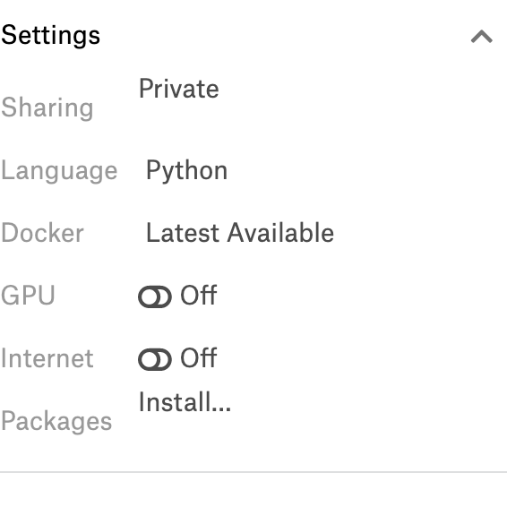

# 5.1 kaggle介绍
## 5.1.1 Kaggle
### 平台简介
Kaggle是由联合创始人、首席执行官安东尼·高德布卢姆（Anthony Goldbloom）2010年在墨尔本创立的，主要为开发商和数据科学家提供举办机器学习竞赛、托管数据库、编写和分享代码的平台。该平台已经吸引了80万名数据科学家的关注，这些用户资源或许正是吸引谷歌的主要因素。

本段摘自[百度百科](https://baike.baidu.com/item/Kaggle/10449376)

通俗的说，Kaggle上面有着各种高质量的数据集，并且基于这些数据集会有一些大的公司进行赞助，来举办一些算法的竞赛，在竞赛时还可通过社区进行讨论（包括比赛中的分享、答疑，和比赛后的top solution分享）。这样就使得全球的顶尖高手会对参加比赛产生兴趣，因为收获到的不仅有奖金还有名气。同时kaggle对萌新也很友好，在社区中可以学到很多的知识和解决方案（top solution）。

### 比赛介绍
kaggle 网站是纯英文的，我们可以把比赛分为2类:

1. 竞赛competitions：竞赛的目的很简单，就是要求在指定时间内（一般是2-3个月）使用出题方的数据完成指定的任务，如果有幸赢得比赛，不但可以获得奖金，模型也可能会被竞赛赞助商应用到商业实践中、获奖者直接进入赞助企业工作或者获得一些重大会议邀请、发表论文等
2. 数据集datasets：数据集是赞助商为了解决某些问题，免费公开了自己的内部的一些脱敏的数据，所有人都可以使用这些数据集进行研究，来改进现有的模型或者优化现有问题的解决方案，但是这些模型或解决方案可以不公开，所以这部分是不提供奖金的，只是能够与别人的方案做对比。

## 5.1.2 Kaggle板块介绍
### Data

这个不用多介绍，就是我们所使用的数据。

这个模块需要认值阅读，它介绍数据的产生方式、存储形式、每个字段的含义等。如果数据规模很大，你没有内存足够大的服务器可以hold住，可能就没法打这个比赛或者使用这个数据集；我们还要注意他的数据类型什么，比如图像数据那就得用深度神经网络，如果对这方面不熟或者没有GPU可用，肯定是没有办法参加这个比赛，不要妄想使用CPU来做CNN计算，至少目前来说是不可能的。
我们可将 kaggle 平台上的比赛分成一下4类：

1.  挖掘：面对的是结构化数据，也就是表格数据，包括了各式各样的预测问题(预测销量、点击率、推荐排序等)，主要的共性就是理解数据，理解问题，从数据中找到有用的信息用来预测，这类问题胜负更多的是在特征上，所以这部分是树形模型的天下比如有名的xgboost。
2.  图像：图像的话那肯定需要CNN了，这部分虽然可以用迁移学习来做，但是要想获得排名大量的算力也是必须的，因为要验证微调的次数也会很多。
3.  语音：这部分不太了解，就不献丑了
4.  NLP ：BERT出来以后各种预训练的权重会对这方面的比赛帮助很大

### Rules

比赛规则。这个必须要看，无论是萌新还是大神，比赛的规则还是要遵守的。

提交次数：这里会写明每天允许的最大提交次数，一般是 5次，假如一个比赛持续时间是三个月，那么总提交次数差不多就是 5×90=450 次。

很多人为了躲过提交次数的限制或者“节省提交次数”，专门注册了小号，这被称为 multiple accounts，是会被 kaggle 的反作弊系统侦察出来的。在比赛结束后，会先公布初步排名，然后 kaggle 平台反作弊系统开始运行，大约两三天后，凡是被判为作弊的队伍直接从排名中移除，几个月的努力就打水漂了！所以这个操作一定要禁止。

另一个是组外私自分享代码和结果，这也是明令禁止的。组队之后队员之间可以分享，或者通过公开的 kernel或discussion区分享。同样，如果被检测出不同队伍或个人间有相似的结果，也会被移除最终榜单。
### Team

在参加比赛的时候可以向别人发起组队邀请，或者接受别人的邀请，三个臭皮匠顶个诸葛亮，组队的好处就不用说了，每个队伍最多4个人，并且是可以共享代码的，这样相当于算力提高了4倍。

另外就是一定要给队伍起个骚气的名字。

### Kernels

。。。(不知道怎么翻译，总之就是核心代码)。支持 Python 语言的脚本 .py 和 .ipynb，和 R 语言的脚本 .R 和 .ipynb。

分 public kernel 和 private kernel。

public kernel是公开的，大家都可以看到，从这里可以学到非常多的东西，当然你自己也可以通过公开自己的 kernel 分享解决方案或观点。

private kernel是你自己的，别人看不见，你可以分享给组内成员。

为方便大家打比赛，kaggle 提供了一些运算资源。kaggle 用户的每个 kernel 可以有 16G 的内存和 4 核CPU，这足够打多数比赛了。另外，提供了 GPU，在新建 kernel 的时候可以选择开启 GPU，但当打开 GPU 时，CPU 和内存资源会少一些，这个后面的薅羊毛指南中会详细介绍。

### Discussion

讨论区，这个区大家会分享观点、讨论问题、甚至寻找组队队友。

kaggle 的分享氛围非常好，对萌新也非常友好。在整个比赛进程中大家不断地分享自己的新发现，很多有用的信息都是在这里获取的。
对于一个新手而言，每天做好 kernel 区和 discussion区的跟踪，有充足的时间尝试他们的想法，应该可以获得一个不错的排名。
比赛结束后，一些大牛甚至会将自己获胜用到的方法、小技巧（tricks）全部分享出来。

###  Leaderboard

排名区，分 public LB 和 private LB。比赛方会将 test 数据集中一部分(比如 30%)拿出来做为 public LB 评分和排名，剩下的部分作为 private LB（也就是最终结果）的评分和排名。

你每天都可以提交并查看自己的答案在 public LB 的得分和排名情况，在比赛结束前需要选择两个提交作为自己的最终答案，比赛结束后，平台会计算你的答案的 private LB 得分并自动挑选得分高的一个作为你的最终成绩。

在讨论区你会经常听到大家讨论 CV score、LB score，指的就是你模型本地交叉验证的得分和提交后的 public LB 得分。

shake up：public LB 得分可能会和 private LB 得分差别很大，比赛结果公布前你可能排名前十，比赛结果公布后发现自己跌到上千名了，这就是所谓的 shake up，一般是模型过拟合了，这个需要在训练的时候就要注意。

## 5.1.3 Kaggle竞赛的排名机制
一般情况下，都是以准确率为导向的排名，毕竟我们的模型计算的准确是第一标准。

针对于比赛而言，在比赛结束之前，参赛者每天最多可以提交5次测试集的预测结果。每一次提交结果都会获得最新的临时排名成绩，直至比赛结束获得最终排名，Kaggle将参赛者每次提交的结果取出25%-33%，并依照准确率进行临时排名。在比赛结束时，参赛者可以指定几个已经提交的结果，Kaggle从中去除之前用于临时排名的部分，用剩余数据的准确率综合得到最终排名。

所以，比赛过程中用于最终排名的那部分数据，参赛者是始终得不到关于准确率的反馈的。这样一定程度避免参赛模型的过拟合，保证评选出兼顾准确率和泛化能力的模型。

## 5.1.4 Kaggle薅羊毛指南
~~Kaggle提供免费访问内核中的NVidia K80 GPU。我的个人理解相当于1060或者1070的水平吧。~~
我们可以在Kernel的界面右侧底端，Setting选项中将GPU开启，这样就可以使用免费的GPU资源了

~~Kaggle只提供6小时的连续GPU使用时间~~，虽然对于大数据量计算来说根本就不够用，但是对于研究，这些已经够了，例如我们在图像识别中经常用到的CIFAR-10 图片分类，一般训练2个小时左右就能够得到比较准确的模型了，这对于入门学习来说已经沟通了。

更新：现在Kaggle提供的GPU为 P100,限制为，每周免费使用30小时,还可以连接google的colab，这样对于我们学习和测试，绝对是足够了。

## 5.1.5 其他的一些数据竞赛平台
除了Kaggle，其实还有不少类似的平台；

[DrivenData]( https://www.drivendata.org/)

[CrowdANALYTIX]( https://www.crowdanalytix.com/community)

[InnoCentive]( https://www.innocentive.com/our-solvers/)

[TundIT]( https://towardsdatascience.com/top-competitive-data-science-platforms-other-than-kaggle-2995e9dad93c)

[Codalab]( https://competitions.codalab.org/)

[Analytics Vidhya]( https://datahack.analyticsvidhya.com/)

[CrowdAI]( https://www.crowdai.org/challenges)

[Numerai]( https://numer.ai/rounds)

[Data Science Challenge]( https://www.datasciencechallenge.org/)

[KDD Cup]( https://www.kdd.org/kdd2019/kdd-cup)

[天池]( https://tianchi.aliyun.com/competition/gameList/activeList)

[腾讯广告算法大赛]( https://algo.qq.com)
